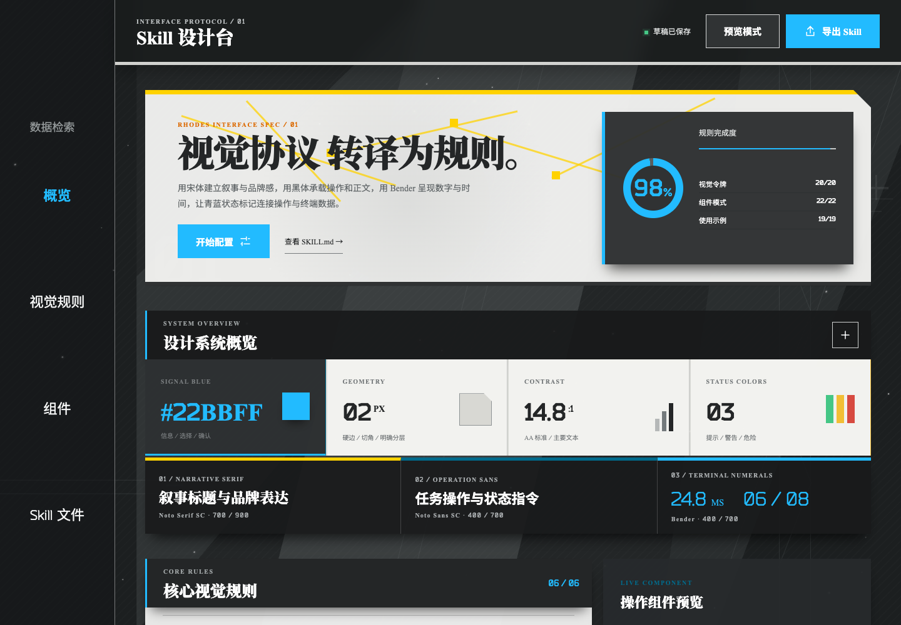

# Arknights Industrial Interface Skill

A Codex Skill and reference studio for building restrained industrial web interfaces inspired by the visual language of Arknights without reproducing official artwork, logos, characters, icons, or protected screen layouts.

The repository combines:

- An English Codex Skill with design rules and implementation workflow.
- Verified visual references for component catalogs and operations dashboards.
- Runnable Vite templates that provide composition anchors instead of fixed product layouts.
- A component studio covering typography, controls, forms, tables, feedback, navigation, and responsive behavior.

## Preview

### Component studio



### Operations dashboard


## Repository Structure

```text
.
├── skills/arknights-interface/
│   ├── SKILL.md
│   ├── agents/openai.yaml
│   ├── references/
│   └── assets/templates/
├── src/                    # Component studio source
├── test/                   # Operations dashboard reference project
├── index.html
└── package.json
```

## Install the Skill

Copy `skills/arknights-interface` into the Codex Skills directory:

```bash
mkdir -p ~/.codex/skills
cp -R skills/arknights-interface ~/.codex/skills/arknights-interface
```

Invoke it with:

```text
Use $arknights-interface to inspect the closest bundled visual reference and refine the current page while preserving its business structure and behavior.
```

## Run the Component Studio

```bash
npm install
npm run dev
```

Build verification:

```bash
npm run build
```

## Run the Operations Dashboard

```bash
cd test
npm install
npm run dev
```

## Design Boundaries

- Use black, charcoal, gray, and cool white as the base palette.
- Use bright signal blue (`#22bbff`) for markers and values on dark surfaces. Blue buttons use the reference blue (`#22bbff`) with white text; blue text on light surfaces uses deep blue (`#006b8c`).
- Use yellow for warnings and sparse priority accents.
- Use Noto Serif SC for major Chinese titles, Noto Sans SC for controls and body copy, Bender for numerals and dates, and Times New Roman for Latin words outside navigation. Sidebar Latin labels also use Bender.
- Do not add button Hover states, full-page grids, blue-purple gradients, or oversized rounded glass cards.
- Use a transparent charcoal sidebar with centered text links, generous vertical spacing, a quiet navigation filter, and a blue current item. Avoid boxed navigation cards and large sidebar branding.
- Use neutral geometric backgrounds, continuously drifting sparse particles, and a thin mouse-following ring with click ripples. Pause particles in hidden tabs; reduced-motion preferences freeze particles and disable the ring.
- Treat the bundled templates as composition references. Preserve the target product's framework, business structure, content, and terminology.

## Intellectual Property Notice

This is an independent, unofficial project. It is not affiliated with, endorsed by, or sponsored by Hypergryph, Yostar, or the Arknights rights holders. Arknights and related names are trademarks of their respective owners. The repository does not distribute official game artwork or extracted assets.

## License

Original source code and documentation in this repository are released under the [MIT License](LICENSE).

Bundled Bender fonts use the SIL Open Font License 1.1. See the [font license](public/fonts/Bender-OFL.txt) and [source note](public/fonts/Bender-SOURCE.txt).
